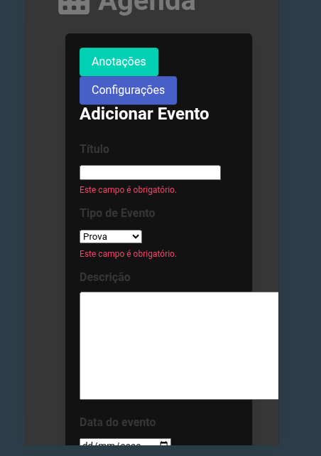

# Feature de agenda
## Feature de eventos com a agenda [inciciado]
- Apenas uma simples organização com notas dos eventos de cada dia

## Mensageria para agenda e anotações [Não iniciado]
- Mensagens informativas automatica <- campo email necessário

## APP mobile [Não iniciado]
- Se possivel, linkar tudo em um app offline, seria ótimo.

### Resultados do dia 14/06/2025:
- form criado no app agenda junto da gerenciamento com classes
- Existe um erro não consertado

### Resultados do dia 1/06/2025:
- Não existem erros nas urls, porem tudo é bém frágil.
- Quero adicionar uma função apenas para as datas importantes ficarem no calendário.
- Quero adicionar mais configurações de cores.

### Resultados do dia 18/06/2025:
- Modelos alterados
- Não esta salvo no git
- Agenda deve ser uma mensagem simples em destaque no endpoint agenda.
Tudo deve estar presente em forma de cards em baixo da agenda (criar, editar excluir)
- Futuramente implementar a funcionalidade "chato" que será avisar constantemente sobre alguma
tarefa ou evento importante.
- O migrate e makemigrations devem ser feitos
- formulario para agenda criado
- O contexto devem ser corrigidos
- Ainda falta dar um "tapa" no template

### Resultados do dia 19/06/2025:
- Coloquei os apps em um unico app
- Agora é possivel adicional eventos na agenda
- Por enquanto sem erros aparentes
- Adicição de tag personalizada
- vêm muitas ideias sobre a agenda, como clicar no dia do evento e poder ver seus detalhes
- Uma refatoração é algo a se considerar apenas no "fim" do projeto.
- Nada do app para android ainda
- Nenhuma configuração em arquivo de ambiente

### Resultados do dia 19/06/2025 (2):
- Adiçãop dos enpoints (não testados de editar e deletar)
- Falta o html e algumas configurações nas urls e funções
- Penso em retirar a frase no quadro e deizar apenas em baixo mesmo
- Conforme a prioridade a cor do quadrado, com a indicação de cores acima,
talvez até combinações de cores de personalização
- Adiçãop dos enpoints (não testados de editar e deletar)

### Resultados do dia 21/06/2025:
- Quero testar o endpoint de eventos, lembre que a ordem é arquivo classes.py -> views.py -> urls.py.
Pode ser o endpoint eventos ou apenas uma vizualizaço na pagina agenda mesmo.
- Lembre das configurações e que todos os endpoints são definidos com <app>:<nome_do_endpoint>
- Com a configuração `app_name`
- O css no tela agenda está com defeito
- O app init não possui urlsm todas suas funcionalidade são passadas ào app main
- as configurações estão no arquivo .env, presente no git, retire, o push ainda não foi feito
- Existem configurações de rotas de login no arquivo settigs.py, bém no início
- O banco de dados é o MySQL

# deploy (python anywhere)

- pip install --user pythonanywhere
- pa_autoconfigure_django.py <link do github> --python=3.10
