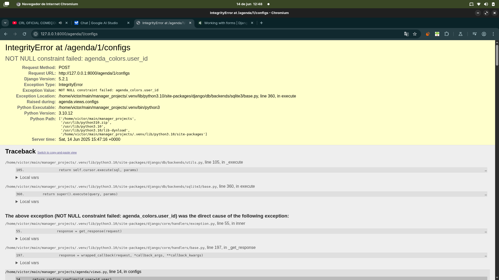
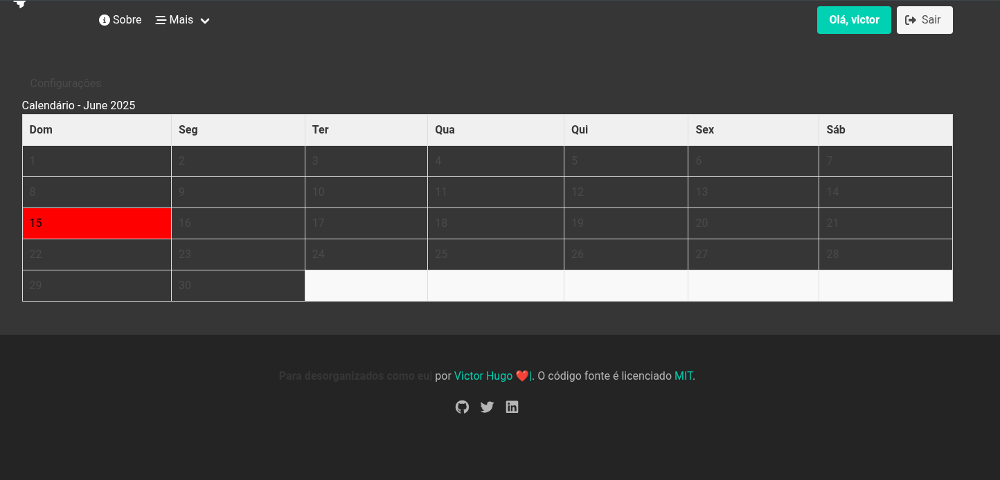
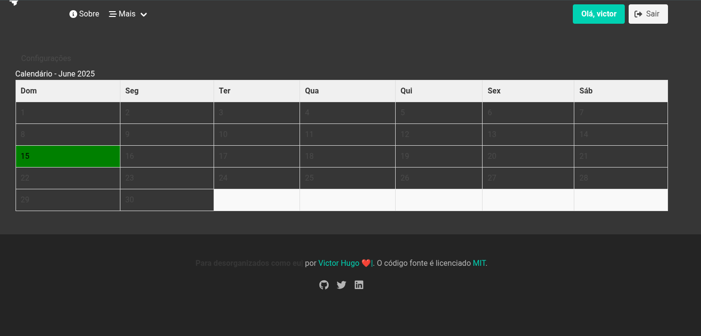

# Feature de agenda
## Feature de cores (nova brach)
- Estou criado a feature para a alteração de cor no css, no momenro não sei se funiona ou não

## Feature de eventos com a agenda [Não iniciado]
- Apenas uma simples organização com notas dos eventos de cada dia

## Mensageria para agenda e anotações [Não iniciado]
- Mensagens informativas automatica <- campo email necessário

## APP mobile [Não iniciado]
- Se possivel, linkar tudo em um app offline, seria ótimo.

### Resultados do dia 14/06/2025:
- form criado no app agenda junto da gerenciamento com classes
- Existe um erro não consertado

### Resultados do dia 1/06/2025:
- Não existem erros nas urls, porem tudo é bém frágil.
- Quero adicionar uma função apenas para as datas importantes ficarem no calendário.
- Quero adicionar mais configurações de cores.

### Resultados do dia 18/06/2025:
- Modelos alterados
- Não esta salvo no git
- Agenda deve ser uma mensagem simples em destaque no endpoint agenda.
Tudo deve estar presente em forma de cards em baixo da agenda (criar, editar excluir)
- Futuramente implementar a funcionalidade "chato" que será avisar constantemente sobre alguma
tarefa ou evento importante.
- O migrate e makemigrations devem ser feitos
- formulario para agenda criado
- O contexto devem ser corrigidos
- Ainda falta dar um "tapa" no template
